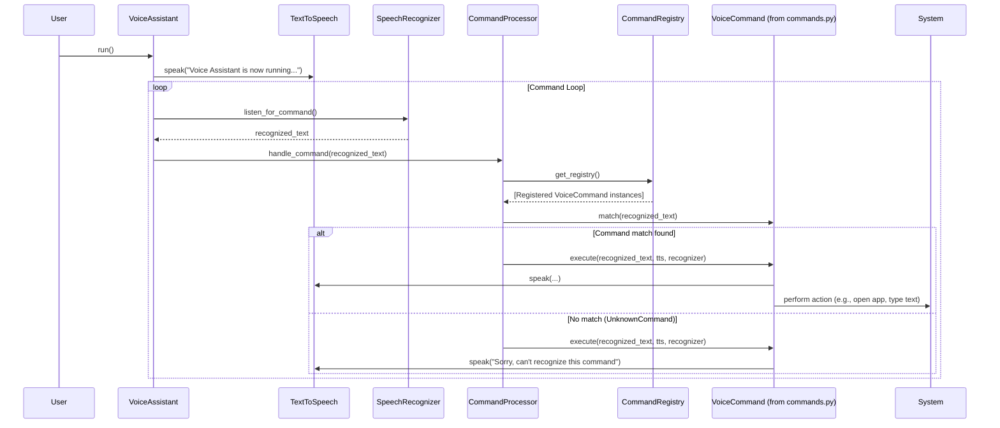

# 🧠 Voice Assistant Sequence Diagram (Modular Design)

This sequence diagram illustrates the updated modular workflow of the Python Voice Assistant:

```mermaid
sequenceDiagram
    participant User
    participant Assistant as VoiceAssistant
    participant TTS as TextToSpeech
    participant Recognizer as SpeechRecognizer
    participant Processor as CommandProcessor
    participant Registry as CommandRegistry
    participant Command as VoiceCommand (from commands.py)

    User->>Assistant: run()
    Assistant->>TTS: speak("Voice Assistant is now running...")

    loop Command Loop
        Assistant->>Recognizer: listen_for_command()
        Recognizer-->>Assistant: recognized_text
        Assistant->>Processor: handle_command(recognized_text)
        Processor->>Registry: get_registry()
        Registry-->>Processor: [Registered VoiceCommand instances]
        Processor->>Command: match(recognized_text)
        alt Command match found
            Processor->>Command: execute(recognized_text, tts, recognizer)
            Command->>TTS: speak(...)
            Command->>System: perform action (e.g., open app, type text)
        else No match (UnknownCommand)
            Processor->>Command: execute(recognized_text, tts, recognizer)
            Command->>TTS: speak("Sorry, can't recognize this command")
        end
    end
```
